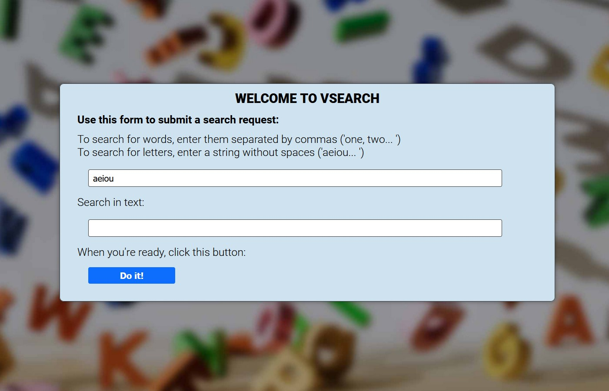
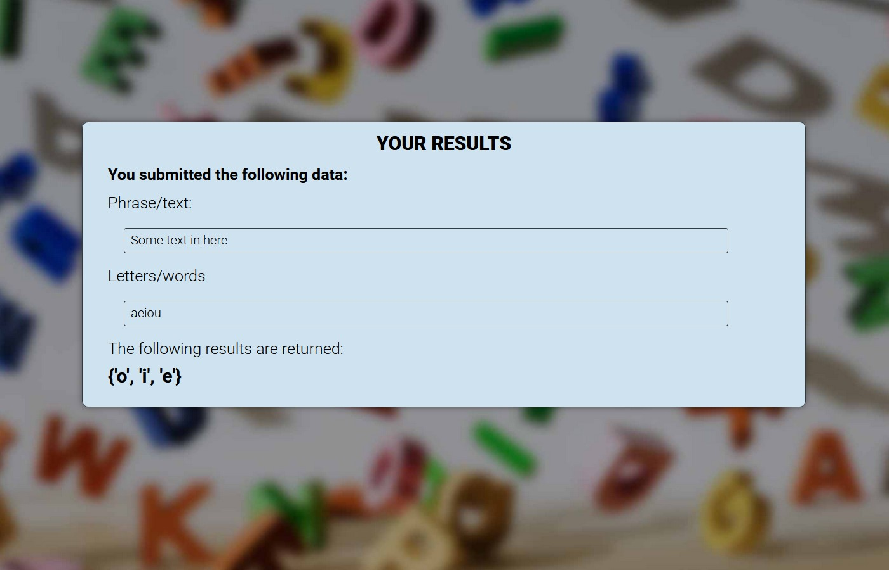

# Vsearch web-application
A simple application based on an example from the book Head First. Updated frontend, added word search functionality.

## Project structure

```
word_searcher/
├── db
│   ├── __init__.py
│   ├── mysqlcm.py
│   └── sqlitecm.py
├── README.md
├── requirements.txt
├── searchtext.py
├── static
│   ├── bg.jpg
│   └── style.css
├── templates
│   ├── base.html
│   ├── entry.html
│   ├── results.html
│   └── viewlog.html
└── vsearch.py
```

## URLs

| route     | description                                      |
| --------- | ------------------------------------------------ |
| /         | Main page (form to fill)                         |
| /searcher | Result page (search results by words or letters) |
| /viewlog  | Log page (all results with user information)     |

### Main page



### Result page



## Installation

```
$ git clone https://github.com/aderny-twc/word_searcher.git
$ cd word_searcher
$ python -m venv venv
$ source /venv/bin/activate
(venv) pip install -r requirements.txt
```

## Database configuration

You need to create a database (MySQL) with these parameters by default (vsearch.py):

```python
app.config['dbconfig'] = {'host': '127.0.0.1',
                            'user': 'vsearch',
                            'password': 'vsearchpasswd',
                            'database': 'vsearchlogDB',}
```

## Application launch

```
(venv) python vsearch.py
```

Runs at localhost address `http://127.0.0.1:5000/`

